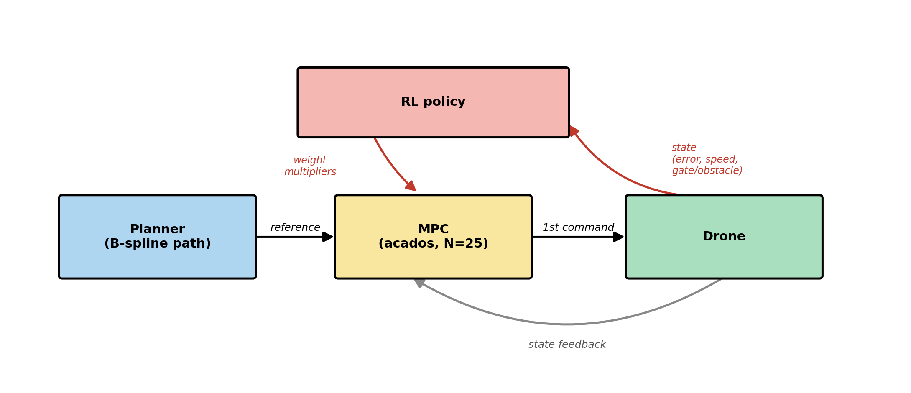

# Model Predictive Contouring Control for Autonomous Drone Racing

> **Time-optimal-ish path following for a racing quadrotor. Track the geometry, optimise the progress.**


> **Note — this is a fork.** This repository is a fork of the
> [LSY Drone Racing](https://github.com/learnsyslab/lsy_drone_racing) course framework
> for the **Autonomous Drone Racing Project Course** at the Technical University of Munich
> (Prof. Dr. Angela P. Schoellig). The upstream framework (simulator, environments,
> difficulty levels, deployment tooling) is unchanged. **My contribution is the MPCC controller
> package [`lsy_drone_racing/control/mpcc/`](lsy_drone_racing/control/mpcc/)** — the MPCC
> controller, its augmented acados model, the warm-started B-spline planner it queries, and an
> (optional) RL layer that adapts the cost weights. Everything else in this repo belongs to the
> upstream project and its authors.

---

## Demo

<div align="center">
  
  <br/>
  <sub><sup style="font-size: 0.8em;">Racing environment — powered by <a href="https://github.com/learnsyslab/crazyflow">Crazyflow</a></sup></sub>
</div>

---

## Overview

Drone racing rewards flying *fast through gates*, not *tracking a clock*. A classic
reference-tracking MPC chases a time-parameterised trajectory `r(t)`: if the drone falls
behind — fighting a disturbance, or simply asked to go faster than it can — the reference
"runs away" and the tracking error explodes, which forces a reference governor / nearest-tick
machinery to keep things stable.

**Model Predictive Contouring Control (MPCC)** removes the clock. The controller follows the
*geometric path* and is free to choose how fast to advance along it. The model is augmented
with a **progress state** `θ` (arc length along the path) and its speed `v_θ`; the cost
penalises the **contouring error** (perpendicular distance to the path) and the **lag error**
(longitudinal), while **rewarding progress** at a target speed. The optimiser trades these off
on its own: hold the line tightly near gates, and push `v_θ` on the straights.

**Why MPCC for racing:**

| | Reference-tracking MPC | **MPCC (this work)** |
|---|---|---|
| Reference | Time-parameterised `r(t)` | Geometry only `p(θ)` |
| "Reference runs away" | Possible → needs a governor | **Impossible** — no clock |
| Speed | Fixed by the trajectory | **Chosen by the optimiser** (`v_θ` reward) |
| Behaviour near gates | Tracks whatever `r(t)` says | Naturally slows to hold the contour |

The path itself comes from a lightweight **B-spline planner** that is **re-planned in the
background** whenever a gate or obstacle pose is revealed, so the controller works across the
course's progressive difficulty levels (randomised inertia, moving gates/obstacles).

---

## Project Status

The **MPCC controller** is fully implemented, races in the Crazyflow simulator, and has been
deployed on real Crazyflie hardware. A learned weight-adaptation layer (RL) is implemented
end-to-end but **not yet trained to convergence** — training rolls out the full acados MPCC per
step, which does not parallelise well and is prohibitively slow on a Mac (no CUDA, acados
solvers are hard to vectorise). The plumbing is in place; it needs compute.

| Component | Status |
|---|---|
| Augmented acados model (drone + progress double-integrator `[θ, v_θ]`) | ✅ Done |
| NONLINEAR_LS contouring / lag / progress cost, path embedded as a cubic in `θ` | ✅ Done |
| Warm-started B-spline `SimplePlanner` (geometric-path API by arc length) | ✅ Done |
| Background re-planning on revealed gate / obstacle poses | ✅ Done |
| Capsule soft-barrier avoidance (obstacle poles + gate frames) in the cost | ✅ Done |
| Curvature-limited progress target (brake before corners, cruise on straights) | ✅ Done |
| Gate-track contouring boost, caution mode, gate-pass barrier | ✅ Done |
| Prediction-divergence safety net (reject off-path "successful" solves) | ✅ Done |
| Receding-horizon primal warm start (shifted previous solution) | ✅ Done |
| Jump-free path projection (local, forward-biased `θ` window) | ✅ Done |
| Live visualisation overlay (path, gates, obstacles, progress marker) | ✅ Done |
| Refactor into a clean `mpcc/` package (config / planner / controller) | ✅ Done |
| **RL layer that adapts the MPCC cost weights in-flight** | 🧩 Implemented, **training not completed** (compute-bound on Mac/acados) |
| Quantitative evaluation (lap time vs. tracking-MPC baseline) | 🚧 Planned |

---

## Method

### Conceptual Pipeline

```
   Gate / obstacle poses (revealed online)
                    |
                    v
        +---------------------------+
        |  SimplePlanner            |   B-spline through gate waypoints,
        |  (warm-started, replans)  |   shaped by scipy.minimize to avoid
        +---------------------------+   obstacles & gate frames
                    |
                    |  geometric path  p(θ), tangent t(θ)   (queried by arc length)
                    v
        +---------------------------+
        |  MPCC  (acados SQP-RTI)   |   state augmented with [θ, v_θ];
        |  contouring + lag + prog. |   per-node path cubic passed as params
        +---------------------------+
                    |
          (optional) per-tick weight scaling  <- RL policy (training incomplete)
                    |
                    v
        Collective-thrust + body-rate command  ->  drone
```

### Augmented Model

The physical drone (12 states / 4 inputs, from `drone_models.so_rpy`) is augmented with a
**progress double-integrator**:

```
   θ̇   = v_θ            θ      : arc-length progress along the path
   v̇_θ = a_θ            v_θ    : progress speed       (state)
                        a_θ    : progress accel.      (extra input)
```

So the optimiser controls *how fast it moves along the path* as a first-class decision
variable. State `x = [pos, rpy, vel, drpy, θ, v_θ]` (14), input `u = [rpy_cmd, thrust, a_θ]` (5).

### Cost (NONLINEAR_LS, Gauss-Newton friendly)

The path is **embedded in the model** (formulation A): for each shooting node the planner's
local **cubic coefficients** in `θ` are passed as acados parameters, so acados evaluates the
path point `p_d(θ)` and tangent *symbolically from the progress state* — the contouring/lag
errors genuinely depend on `θ`, not on a frozen reference:

```
   d   = pos - p_d(θ)
   e_l = t(θ) · d                 lag  (longitudinal, signed)
   e_c = d - e_l · t(θ)           contouring (perpendicular, 3-vector)
   e_v = v_θ - v_target           progress-speed tracking  (the "reward")
```

| Cost term | Weight | Role |
|---|---|---|
| **Lag** `e_l` | `q_l = 150` | Keep the progress point locked to the drone so `θ` can't drift (dominant) |
| **Contouring** `e_c` | `q_c = 50` | Stay *on* the path — hold the racing line |
| **Progress** `e_v` | `q_v = 5` | Push `v_θ` toward the target speed (advance eagerly) |
| **Attitude / rates** | `q_att = 1, q_dr = 5` | Smooth, flyable orientation |
| **Input** `rpy_cmd, thrust, a_θ` | `r_rpy = 1, r_T = 50, r_at = 0.5` | Regularise effort |

A strong lag weight glues `θ` to the drone; contouring holds the line; the modest progress
reward advances it. Near a gate the contouring weight `q_c` is temporarily boosted (`×4`) so the
prediction is pulled tightly onto the gate-centred line exactly where precision matters. All
weights live in one place — [`mpcc/config.py`](lsy_drone_racing/control/mpcc/config.py).

### Collision Avoidance

Obstacle poles and gate frames are kept out with a **smooth soft-barrier in the cost**, not a
hard constraint. Each keep-out is a **capsule** (segment `p1→p2` with radius `r`), and the
barrier `max(0, 1 − d²/r²)²` (with `d` = distance from the drone to the capsule axis) is
penalised. A cost barrier never makes the QP infeasible and adds no inequality rows / slacks,
and the capsule shape lets the drone thread a gate opening while avoiding the frame bars — so no
per-gate enable/disable is needed. A one-sided **ground-clearance** residual keeps the drone
from sinking into the floor while it accelerates off the start.

---

## Technical Features

- **Progress-augmented acados OCP** — `[θ, v_θ]` states + `a_θ` input; CasADi symbolic drone
  dynamics, `FULL_CONDENSING_HPIPM` + real-time `SQP_RTI` (one SQP step per tick, ~50 Hz).
- **Path embedded as a cubic in `θ`** — per-node cubic coefficients passed as parameters, so
  `p_d(θ)`/tangent are symbolic in the progress state (formulation A, MPCC++ eq. 5).
- **Geometric-path planner API** — `SimplePlanner.path_point_tangent(θ)` maps arc length to
  `(point, unit-tangent)` via a cached arc-length LUT; `project_to_theta` snaps the drone onto
  the path.
- **Capsule soft-barrier avoidance** — obstacle poles + gate frames as capsules penalised in the
  cost; never infeasible, threads gate openings while avoiding the bars.
- **Curvature speed limiting** — caps the progress target by upcoming path curvature
  (`v_cap = √(a_lat_max / κ)` over a short look-ahead), so the drone brakes *before* sharp
  reversals and cruises on straights.
- **Caution mode** — slows toward a nearby gate/obstacle whose pose is still uncertain, then
  resumes cruise once it is measured (which also triggers a re-plan onto the corrected path).
- **Gate-pass barrier + retry** — `θ` is capped just past each gate centre until the env's
  authoritative gate-pass detection confirms the crossing, so the drone finishes the current
  gate instead of skipping ahead.
- **Prediction-divergence safety net** — rejects a "successful" solve whose predicted trajectory
  strays off the path beyond the current offset, forcing a clean re-localise; guards real
  hardware against slamming a frame.
- **Jump-free projection** — the projection is restricted to a *local, forward-biased* `θ`
  window, so where the path passes near itself (gate-and-back, U-turns) it can never teleport
  onto the wrong branch and "shortcut".
- **Receding-horizon primal warm start** — the previous solution is shifted one node forward and
  fed back, so SQP-RTI converges from a good iterate each tick.
- **Background re-planning** — a `ThreadPoolExecutor` rebuilds the full-track path off the
  control thread when a gate/obstacle moves, so the 50 Hz loop never stalls.
- **Warm-started B-spline planning** — gate waypoints + freely-shifted intermediates optimised
  by L-BFGS-B (obstacle + gate-frame + deviation cost), the previous solution seeding the next.
- **Graceful degradation** — failed solves hold the last command for a few ticks, then brake to
  hover, rather than crashing.
- **Live overlay** — planned path, gates + frames, obstacle poles, drone progress marker `θ`,
  and the far end of the horizon.

---

## RL-Tuned MPCC Weights (implemented, training incomplete)

The MPCC cost weights (`q_c, q_l, q_v, …`) are, at deployment, **static hand-tuned baselines**.
An additional layer — a **reinforcement-learning policy that adapts these weights in-flight, per
tick**, from the drone's state — is implemented end-to-end but **not yet trained to convergence**
(see *Project Status*: the acados-in-the-loop rollout is compute-bound on a Mac). With the policy
off (the default) the controller uses the baseline weights verbatim.

<div align="center">
  
</div>

**Design (as implemented in [`weight_policy.py`](lsy_drone_racing/control/mpcc/weight_policy.py) / [`train_weights.py`](lsy_drone_racing/control/mpcc/train_weights.py)):**

- **Hook point:** in `compute_control`, just before `solve()`: `features → policy → new W →
  cost_set(stage, "W", W_new) → solve`. acados updates `W` without a rebuild; the planner is
  untouched (clean split: planner = global, MPCC = local, RL = tuning).
- **Action space:** bounded *multipliers* on the baseline weights (not absolute weights — too
  fragile), kept in range by an activation at the policy output.
- **Observation:** tracking/contouring error, speed, distance & angle to the next gate,
  remaining thrust margin, plus angle & distance to the nearest obstacle.
- **Key risk:** solver robustness — extreme weights stiffen the QP. Bounded actions are
  near-mandatory, since failed solves fall back to the last command and poison the learning signal.
- **Training:** offline in simulation (reward: gate-pass time, crashes, tracking error), policy
  frozen at deployment. Lit. pointers: RL-tuned MPC, Gros & Zanon, differentiable MPC (Amos).

> Status: **implemented, not fully trained.** The wiring, feature builder, network, and training
> loop exist; completing training needs GPU-backed compute or a vectorisable simulator.

---

## Repository Structure

> Only the `mpcc/` package is my own work; the rest is the upstream LSY framework.

```
lsy_drone_racing/
|
+-- lsy_drone_racing/
|   +-- control/
|   |   +-- mpcc/                     # ★ THIS WORK
|   |   |   +-- config.py             # all tuning constants (planner / controller / weights)
|   |   |   +-- planner.py            # geometry helpers + SimplePlanner (B-spline path)
|   |   |   +-- controller.py         # acados MPCC solver builders + MPCCController (entry point)
|   |   |   +-- weight_policy.py      # RL weight-scaling policy (feature builder + network)
|   |   |   +-- train_weights.py      # RL training loop (compute-bound, see status)
|   |   +-- controller.py             # base Controller interface (upstream)
|   +-- ...                           # envs, wrappers, utils (upstream)
|
+-- config/                           # level0..3 + sim2real task definitions (upstream)
+-- scripts/                          # sim.py / sim_eval.py / deploy.py entry points (upstream)
+-- figures/                          # diagrams (path planning, MPC/RL block diagrams, speed profile)
+-- docs/                             # course documentation (upstream)
+-- acados/  c_generated_code/        # acados install + generated solver code
+-- pyproject.toml  pixi.lock
+-- README.md
```

The `mpcc/` package is self-contained: its own augmented model, OCP, planner, geometry helpers,
visualisation, and (optional) RL weight policy. Every tunable value lives in `config.py`.

---

## Installation

This fork keeps the upstream environment. Use the project's `pixi` environment:

```bash
git clone https://github.com/mangam-02/lsy_drone_racing.git
cd lsy_drone_racing
pixi shell --frozen
```

See the upstream
[official documentation](https://learnsyslab.github.io/lsy_drone_racing/getting_started/general/)
for full setup, including the `acados` build. On Apple Silicon the repo's bundled Linux `acados`
must be rebuilt for arm64 — see the project notes.

---

## Usage

### Simulation

The MPCC controller is wired into every race config via `[controller] file = "mpcc/controller.py"`.
Run it in the simulator on any difficulty level:

```bash
python scripts/sim.py --config config/level2.toml
```

Evaluate over randomised episodes (success rate + lap times):

```bash
python scripts/sim_eval.py --config config/level3.toml
```

The competition environment uses **level 2** (randomised inertia + moving gates/obstacles,
re-planning required), which is what the background-replanning path planner is built for.

### Real hardware

```bash
python scripts/deploy.py --config config/level0.toml
```

### Tuning

Every knob lives in one place, [`mpcc/config.py`](lsy_drone_racing/control/mpcc/config.py), split
into clearly labelled `PLANNER`, `CONTROLLER`, and `MPC COST WEIGHTS` sections. Editing a value
there changes behaviour without touching any logic.

---

## Implementation Details

| Component | Choice | Rationale |
|---|---|---|
| Path following | MPCC (contouring + lag + progress) | No clock → reference can't run away; speed chosen by optimiser |
| Progress model | `θ`, `v_θ` double-integrator with input `a_θ` | Makes "how fast along the path" a decision variable |
| Path embedding | Per-node cubic coefficients as acados parameters | `p_d(θ)`/tangent evaluated symbolically from the state |
| Cost type | `NONLINEAR_LS`, Gauss-Newton | Fast, reliable residual for the least-squares cost |
| QP solver | `FULL_CONDENSING_HPIPM`, `SQP_RTI` (1 step/tick) | Small dense QP, real-time; fits the ~20 ms budget |
| Obstacle / gate avoidance | Capsule soft-barrier in the cost | Never infeasible; threads gate openings while avoiding bars |
| Corner handling | Curvature-limited progress target | Brakes before reversals, cruises on straights |
| Robustness | Prediction-divergence rejection + relocalise | Guards against off-path "successful" solves |
| Warm start | Shifted previous solution (primal) + per-stage `θ` seed | SQP-RTI starts from a good iterate |
| Path planner | Weighted cubic B-spline + L-BFGS-B waypoint shift | Smooth, fly-through gates, obstacle/frame-aware, warm-started |
| Projection | Local forward-biased arc-length window | `θ` advances continuously, never snaps onto an old branch |
| Re-planning | Background thread on revealed pose change | 50 Hz control loop never stalls |
| Framework | acados + CasADi + scipy (+ PyTorch for RL) | Symbolic dynamics, fast embedded NLP, lightweight planning |

---

## Future Work

- **Finish RL weight training** — on GPU-backed compute / a vectorisable simulator, then quantify
  RL-vs-baseline success rate, lap time, and solve time.
- **Quantitative evaluation** — lap time, gate-pass rate, and solve time vs. the
  reference-tracking MPC baseline across levels 0–3.
- **Higher cruise speeds** — tighter curvature and gate-boost tuning on level 3.
- **sim2real transfer** — further deployment on the physical Crazyflie with the level-2/sim2real
  configs.

---

## Acknowledgements & Credits

- **Course framework:** [LSY Drone Racing](https://github.com/learnsyslab/lsy_drone_racing) and
  [Crazyflow](https://github.com/learnsyslab/crazyflow), by the
  [Learning Systems Lab (LSY)](https://www.ce.cit.tum.de/lsy/home/), TUM. All upstream code,
  simulator, environments, and tooling are theirs.
- **My contribution:** the MPCC controller, its planner, and the RL weight layer in
  [`lsy_drone_racing/control/mpcc/`](lsy_drone_racing/control/mpcc/).

## References

1. Lam, D., Manzie, C., Good, M. **Model predictive contouring control.** CDC, 2010.
2. Liniger, A., Domahidi, A., Morari, M. **Optimization-based autonomous racing of 1:43 scale RC cars.** Optimal Control Applications and Methods, 2015.
3. Romero, A. et al. **Model Predictive Contouring Control for Time-Optimal Quadrotor Flight.** IEEE T-RO, 2022.
4. Verschueren, R. et al. **acados — a modular open-source framework for fast embedded optimal control.** Mathematical Programming Computation, 2022.
5. Gros, S., Zanon, M. **Data-driven economic NMPC using reinforcement learning.** IEEE TAC, 2020.

---

*Project for the **Autonomous Drone Racing Project Course** (SS26), Prof. Dr. Angela P. Schoellig, Technical University of Munich (TUM). Built on the LSY Drone Racing framework. This is a fork; the MPCC controller is the author's own contribution.*
